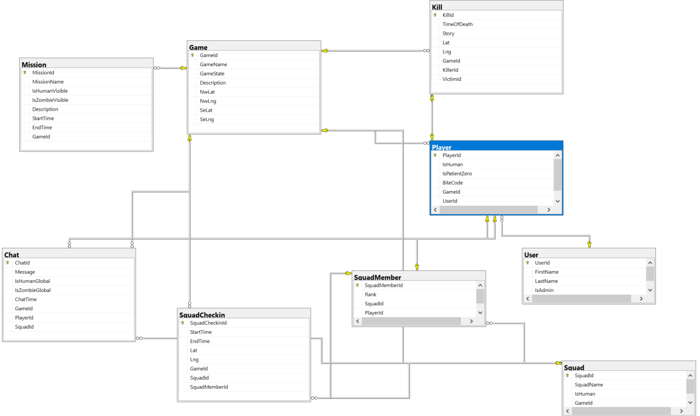

# HumanVsZombies
It is an ASP.NET Core Web API in C# and an Entity Framework Code First workflow. The nine entitites have full CRUD operations plus additional reports to the basic reads. The Web API uses Swagger for documentation and design.

## Installation

* .NET Framework
* SQL Server Managment Studio
* Visual Studio 2017/19 OR Visual Studio Code

Install NuGet packages:

- Microsoft.EntityFrameworkCore 
- Microsoft.EntityFrameworkCore.Tools
- Microsoft.EntityFrameworkCore.SqlServer
- Microsoft.VisualStudio.Web.CodeGeneration.Design
- AutoMapper.Extensions.Microsoft.DependencyInjection
- Swashbuckle.AspNetCore

## Usage

Clone the repository to a local directory.

    git clone https://github.com/RebeckaOcampoSandgren/HumansVsZombies-Backend
    cd HumansVsZombies-Backend

Open in Visual Studio.

Connect to your local server. Go to the "appsettings.json" and change:

    "DefaultConnection": "Data Source = <<NAME OF CONNECTION STRING>>; Initial Catalog = HvZDb; Integrated Security = True;"

To create the database, open Package Manager Console in Visual Studio an run:

    update-database

Run program with button with the *green arrow and IIS Express*

## Visuals

ER Diagram for the Humen vs. Zombies database.

## Contributors

Rebecka Ocampo Sandgren - @rebsan00003

Negin Bakhtiarirad - @neginb

Betiel Yohannes - @betielyohannes

Fadi Akkaoui - @FadiAkkaoui

## Project status

The minimal Viable Product for the assignmement works.

Features to add:
* Functionality to chat in real-time
* Functionality to get squad details 

